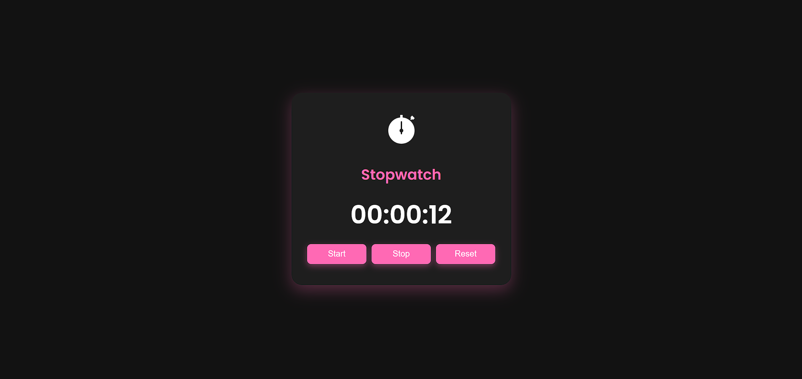

# ⏱️ Responsive Stopwatch Web App

A sleek and fully responsive **Stopwatch** built with HTML, CSS, and JavaScript. This stopwatch features a **dark mode interface** with an elegant **pink theme**, subtle animations, and a mobile-friendly layout. Ideal for time tracking in workouts, tasks, or coding sessions.

---

## 🚀 Features

- Dark-themed UI with modern design
- Elegant pink highlights for an attractive look
- Responsive layout for all devices (desktop, tablet, mobile)
- Simple controls: Start, Pause, Reset
- Smooth animations and hover effects
- Stopwatch icon for visual appeal

---

## 📸 Preview



---

## 📁 Project Structure
stopwatch-app/
│
├── index.html # Main HTML structure
├── style.css # Styles (dark background, pink theme, responsive)
├── script.js # JavaScript logic for stopwatch functionality
├── assets/
│ └── stopwatch.png # Stopwatch icon/image
└── README.md # Project documentation


---

## 💻 Setup Instructions

1. **Clone or Download this Repository**

   ```bash
   git clone https://github.com/your-username/stopwatch-app.git
2. **Navigate to the Project Directory**

```bash
cd stopwatch-app.

